# DECODE-RAPL: Summary Report (Interim Closure)

**DECODE-RAPL: Delayed Embedding COnvolutional network for DEcoding RAPL**

**Date:** October 23, 2025

**Objective:** RAPL (Running Average Power Limit) is a power meter written in silicon in the CPU. The aim of this work was to emulate RAPL as a deep learning model using OS-level metrics (which are also visible in VM). 

---

## 1. Introduction

Accurately estimating CPU power consumption is crucial for energy efficiency and resource management, especially in virtualized environments where direct hardware measurements like Intel's RAPL are often unavailable. This project, **DECODE-RAPL** (**DE**layed **E**mbedding **CO**nvolutional network for **DE**coding RAPL), aimed to develop a methodology for predicting CPU power consumption using only readily available operating system (OS) metrics visible within a Virtual Machine (VM).

---

## 2. Motivation: Beyond Linear Models - A Dynamical Systems Approach

Initial analysis and prior work indicated that CPU power consumption is **not a simple linear function of CPU utilization**. The same utilization percentage can yield vastly different power draws depending on the *type* of workload being executed (e.g., compute-bound vs. I/O-bound vs. syscall-heavy). Simple linear regression models based solely on CPU percentage fail to capture this complexity. History of CPU metrics matter: a CPU arriving at 70% usage will have different power characteristics if it arrives from 40%→70% versus 90%→70%.

**Why do workload types differ in power consumption?** The **core hypothesis** of this work is that OS-level metrics alone are fundamentally insufficient because they miss critical **microarchitectural details** that dictate power draw. Two workloads with identical CPU utilization percentages can have vastly different:
* **Instruction mix** (integer vs. floating-point operations, branch-heavy vs. linear code)
* **Cache behavior** (L1/L2/L3 hit rates, memory access patterns)
* **Pipeline utilization** (instruction-level parallelism, stalls, hazards)
* **Functional unit activation** (which CPU execution units are powered on)

These hidden microarchitectural states are not exposed to the OS or VM guest. Standard OS metrics (`user%`, `system%`, `iowait%`, `ctx/sec`) provide only **partial observations** of the true system state. This observation gap is what makes power prediction from VM-visible metrics fundamentally challenging.

Therefore, this project adopted techniques from **dynamical systems theory**. The core idea is to treat the CPU and its power consumption as a complex dynamical system whose full state is not directly observable. We aimed to reconstruct a representation of this hidden state using **delay embedding** on the *partial measurements* available to us (OS-level metrics). By transforming the time series of these metrics into a higher-dimensional phase space, we hoped to capture the system's underlying dynamics and implicitly recover information about the hidden microarchitectural states.

**Deep learning**, specifically **autoencoders**, were chosen to learn a compressed, low-dimensional **latent space** from these high-dimensional delay embeddings. The hypothesis was that this learned latent space would represent the essential state of the CPU's workload—including implicit signatures of microarchitectural behavior—and could be used to accurately predict instantaneous power consumption, effectively "decoding" the RAPL behavior from observable OS metrics.

---

## 3. Initial Challenge & Approach (v1)

The primary challenge identified early on was the model's inability to distinguish between different workload types exhibiting similar CPU utilization.

### Architecture:
The initial v1 model employed **Delay Embedding + Autoencoder (AE) + LSTM**. An MLP-based Autoencoder (Encoder+Decoder) created a latent space from delay-embedded features (CPU % or {User%, System%, Ctx Switches/sec}). An LSTM processed sequences of latent states for power prediction. Input shape: `(batch, window_size, num_features * embedding_dim)`.

    

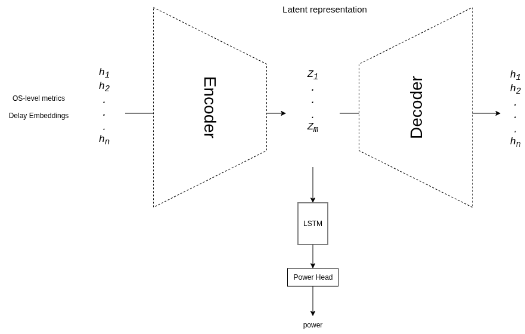

*Figure 1: Diagram of the initial v1 Autoencoder + LSTM architecture.*

The total loss function combined weighted contributions from the power prediction task, the autoencoder reconstruction task:

$$
\mathcal{L}_{\text{total}} = \alpha \cdot \mathcal{L}_{\text{power}} + \beta \cdot \mathcal{L}_{\text{reconstruction}} 
$$

Where:
* $\mathcal{L}_{\text{power}}$ is the loss on the power prediction (e.g., Mean Squared Error between predicted and actual power).
* $\mathcal{L}_{\text{reconstruction}}$ is the loss comparing the autoencoder's output to the original input (e.g., Mean Squared Error).

*Figure 2: Delay embedding visualization showing how past observations create a phase space representation.*

### Data:
Training used ~2 hours of varied `stress-ng` workloads collected on bare metal.

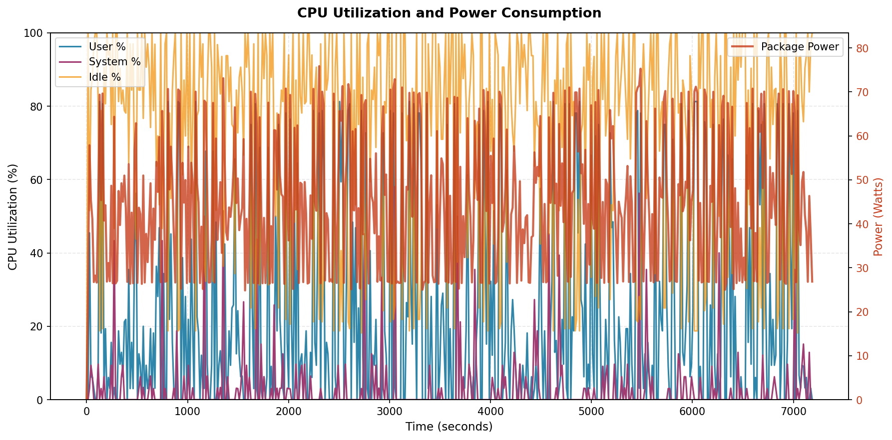

*Figure 3: Training data showing ~2 hours of diverse stress-ng workloads with corresponding CPU and power characteristics.*

### Results: 
The model performed exceptionally well on withheld `stress-ng` test data (R² ≈ 0.97, MAPE ≈ 2-3%), but **failed significantly** on real-world, non-`stress-ng` workloads (R² ≈ 0.29-0.40, MAPE ≈ 8-12%). It exhibited a large positive bias (~+10W) while still tracking overall trends.

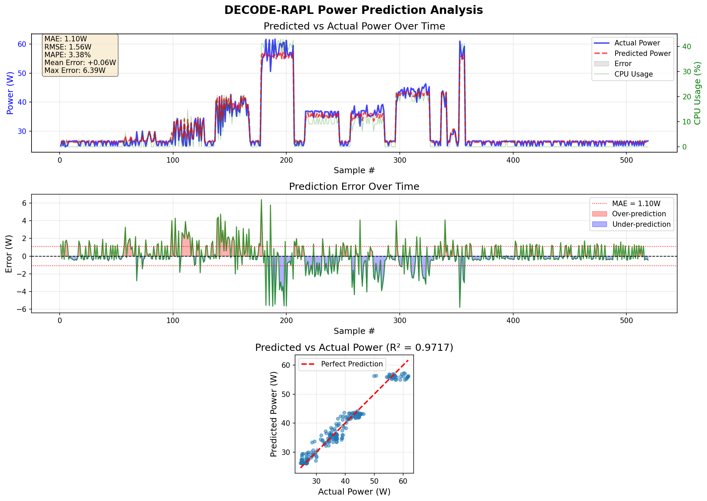
*Figure 4: Excellent predictions on stress-ng workload (R²=0.9717)*

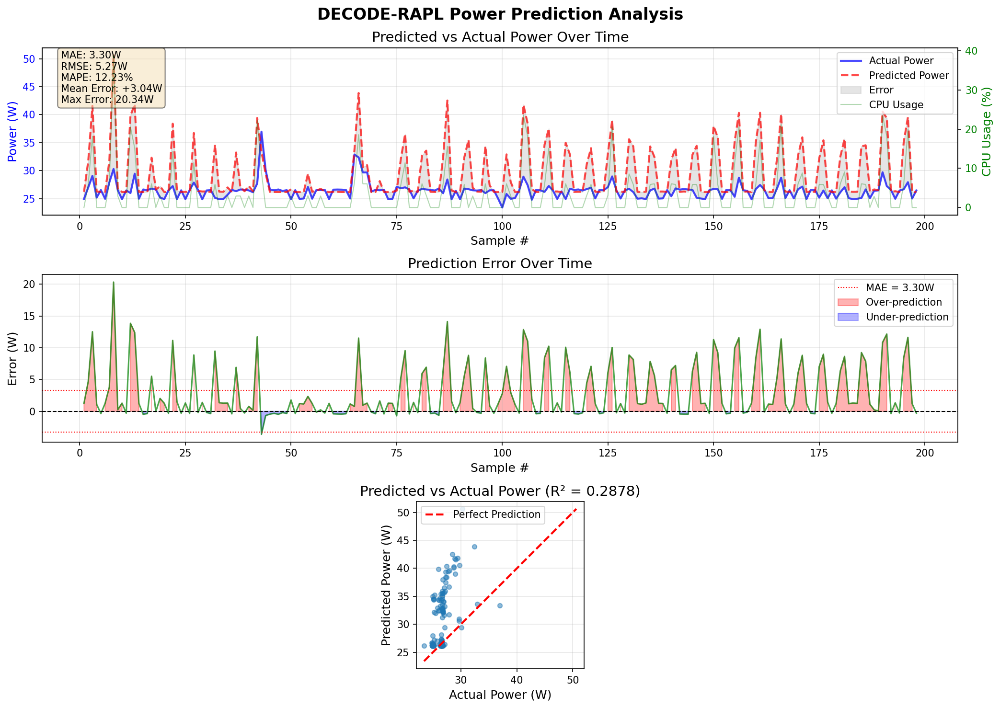
*Figure 5: Poor predictions on real workloads - systematic overprediction*

### Conclusion: 
The initial model primarily memorized `stress-ng` patterns. The training data lacked sufficient diversity. Feature pollution (context switch outliers) and potential architectural limitations (LSTM redundancy, latent bottleneck) were also identified.

---

## 4. Phase 1: Enhanced Data Collection Strategy ("Gold Mine")

Recognizing the data limitation as paramount, a robust data generation and collection pipeline was developed.

* **Refined Features:** Based on analysis, the core VM-visible features selected were:
    1.  User CPU % (`user%`)
    2.  System CPU % (`system%`)
    3.  I/O Wait % (`iowait%`)
    4.  Log-transformed Context Switches/sec (`log1p(ctx/sec)`)
* **Combinatorial Workload Generator:** A script (`run_workloads.sh`) was created to execute permutations of various `stress-ng` stressors (`--cpu`, `--syscall`, `--io`, `--pipe`, `--vm`, `--cache`) with scaled worker counts, generating **2025+ unique, sustained workload combinations** designed to cover a wide state-space.
* **Low-Overhead Collector:** A **Go-based tool** was developed (`my_data_collector`) to sample the 4 features and RAPL power at **16ms intervals** with minimal CPU footprint, ensuring accurate measurements without observer interference.
* **Dataset:** This process yielded a comprehensive dataset ("gold mine") of **~5.8 million samples** after trimming startup/shutdown transients. Explicit "true idle" runs were included. Samples from a target "real-world" workload (`/proc` reader) were later added.
* **Preprocessing:** Delay embedding (`d=25`, `tau=1/4/8`) was applied, creating 100-dimensional input vectors. Crucially, a **"Global Shuffle"** split was implemented (concatenate all processed samples, shuffle globally, then split 80/10/10 for train/val/test) to prevent temporal data leakage. **Feature Normalization** (`MinMaxScaler` fit *only* on the training split) was implemented and verified.

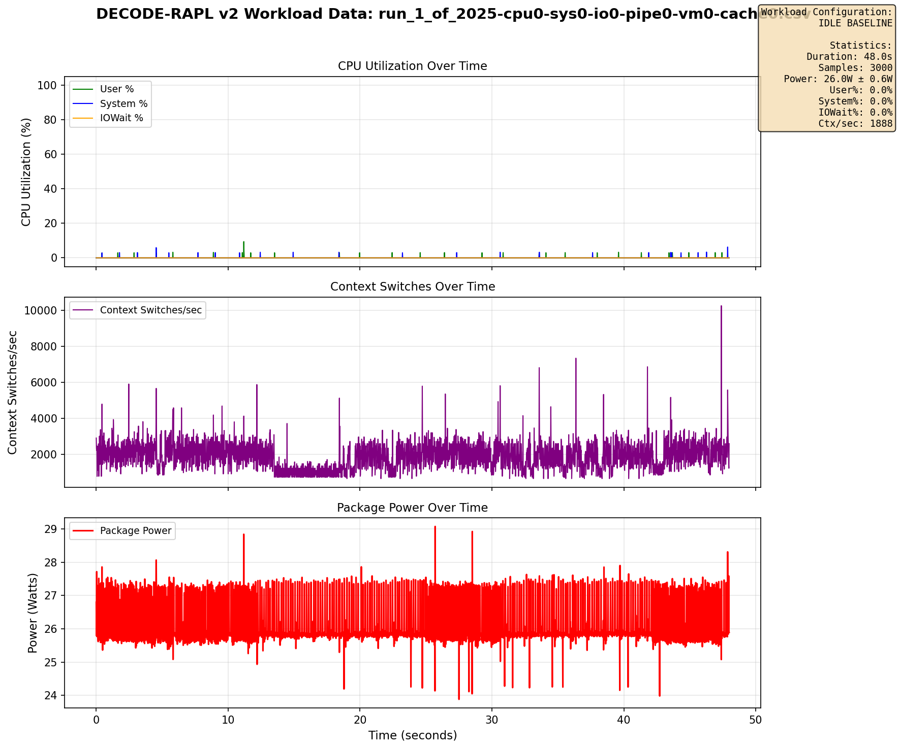
*Figure 6: Example data from an "all-zero" run in the training set, showing true idle characteristics.*

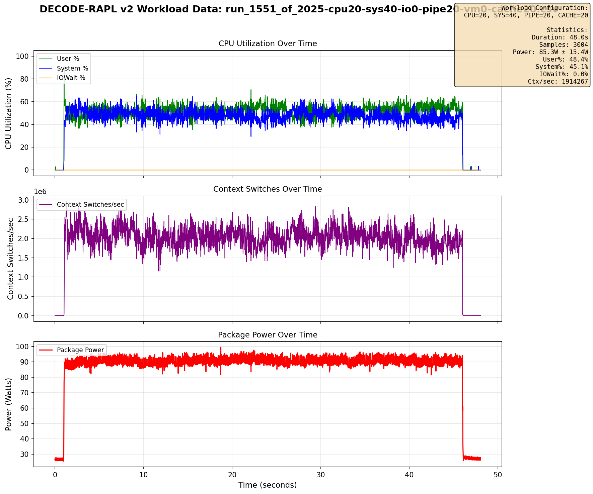
*Figure 7: Another example data from the training set, showing user/sys cpu power characteristics.*

> **Data availability:** the 5.8M-sample training dataset was collected at the author's employer; public release is currently under internal review and is not yet available. Workload generator scripts and the Go collector are included in this repo so the dataset can be reproduced on any bare-metal Intel machine with RAPL exposed.

---

## 5. Phase 2: Iterative Model Development & Training Results

Leveraging the new dataset, several architectural refinements were tested, consistently showing a disconnect between offline (shuffled test set) and live (sequential test workload) performance.

### v2: Autoencoder + Power Head
* **Architecture:** Simplified v1 by removing the LSTM. Attached a dedicated MLP Power Head directly to the autoencoder's latent space. Input shape: `(batch, 100)`.

    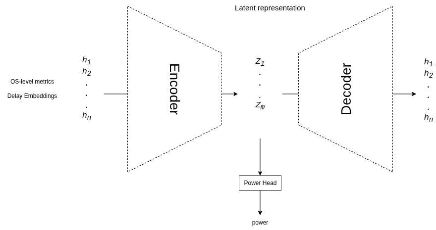

    *Figure 8: Diagram of the v2 Autoencoder + Power Head architecture.*

* **Rationale:** The LSTM was removed to test whether the delay embedding itself provides sufficient temporal state representation, or if the LSTM was merely contributing to overfitting on `stress-ng` patterns seen in v1. By processing flattened delay-embedded vectors directly through an autoencoder, we aimed to determine if simpler architectures could generalize better.

* **Results:** The model began to overfit almost immediately, with validation loss minimizing at epoch 2, indicating it failed to learn a generalizable representation without proper normalization.

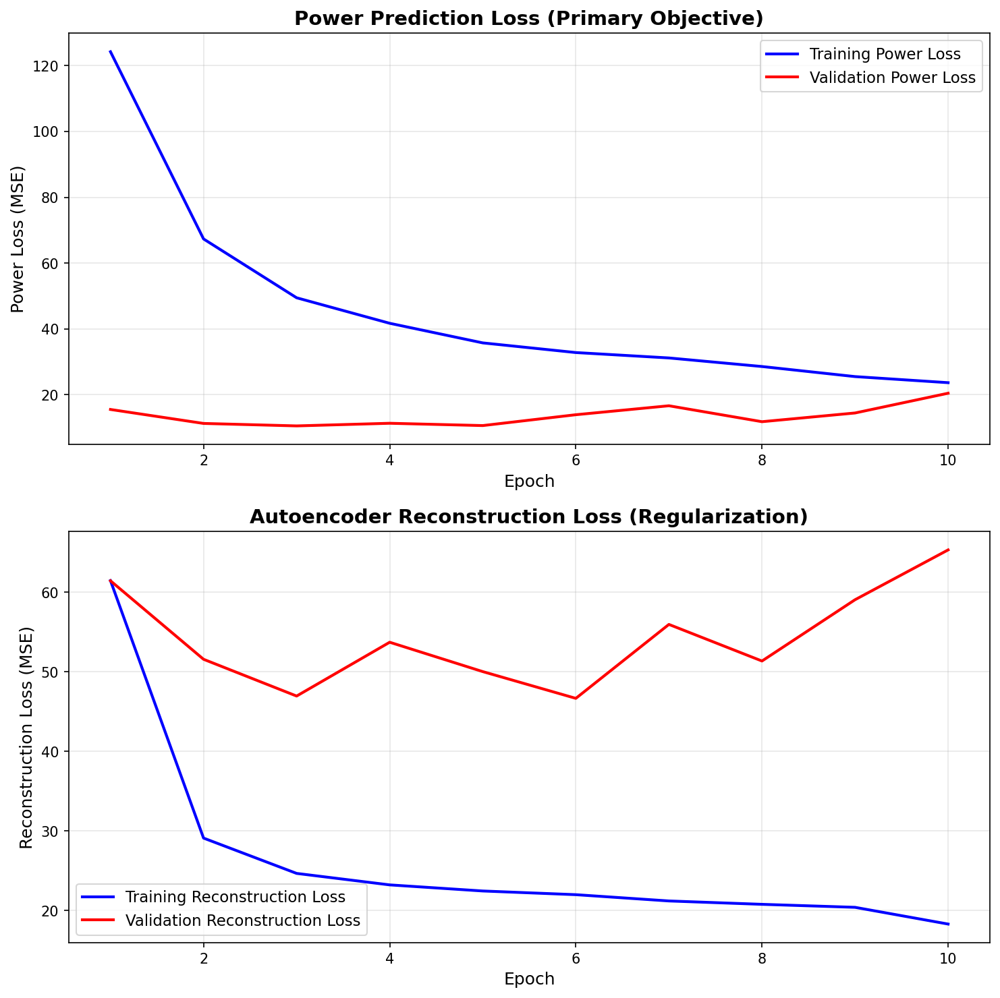
*Figure 9: v2+Norm training showed stability and good validation loss.*

### v3: Encoder + Power Head (Pure Predictor + Normalization)
* **Architecture:** Further simplified by removing the Decoder and reconstruction loss. Focused solely on predicting power from the encoded latent state. Input shape: `(batch, 100)`.

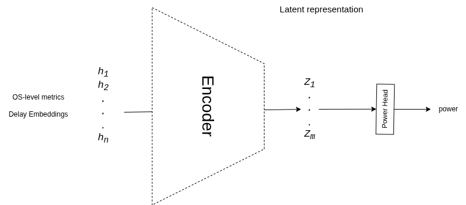

*Figure 10: Diagram of the v3 Encoder + Power Head architecture.*

* **Rationale:** The decoder and reconstruction loss were removed based on the hypothesis that forcing the encoder to reconstruct input features might create a latent bottleneck that hinders power prediction. By removing this auxiliary task, we aimed to allow the encoder to learn latent representations optimized purely for power prediction, unconstrained by the need to preserve feature-level information. Normalization (`MinMaxScaler`) was also introduced to ensure features operate on similar scales.

* **Results:** Better training dynamics. The training went on till epoch 85/100 with validation loss minimizing at 70/100. Showed **best offline results** (Val R²≈0.96, Val MAE≈2.16W) and stable training over 67 epochs. However, **live prediction still failed** significantly on idle and real workloads.

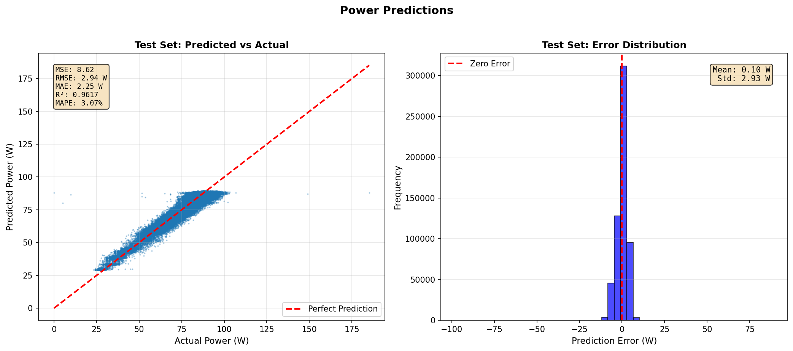
*Figure 11: v3+Norm showed excellent offline test set performance (R²=0.9617).*

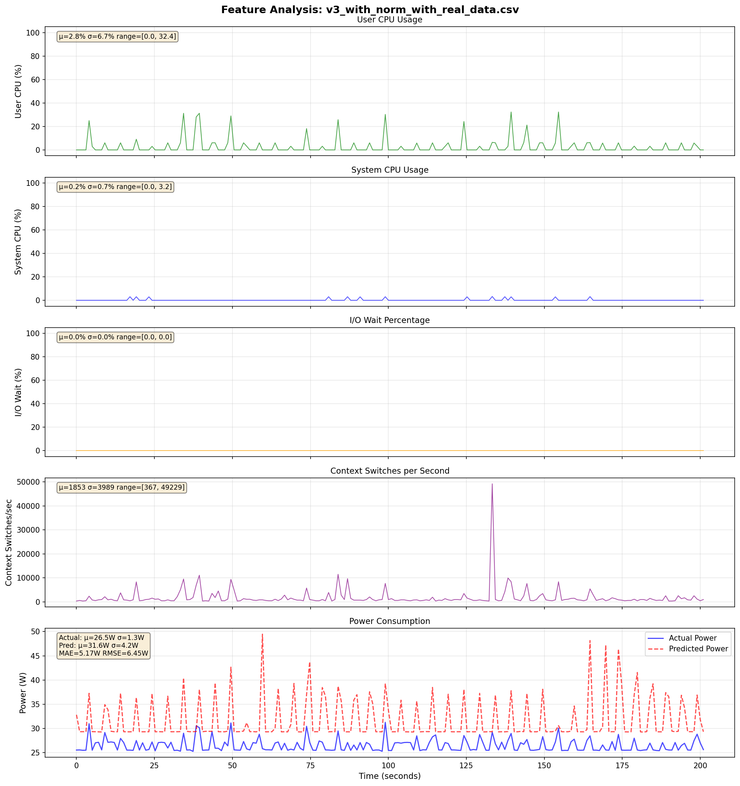
*Figure 12: Live prediction with v3+Norm still showing significant errors.*

### v4: 1D-CNN Encoder + Power Head (+ Normalization)
* **Architecture:** Replaced the initial MLP layers of the v3 encoder with 1D Convolutional (`Conv1d`) layers to explicitly process temporal patterns within the delay embedding for each feature. Input reshaped to `(batch, 4, 25)`. Tested with MAE loss and `tau=1, 4, 8`.

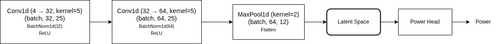

*Figure 13: Diagram of the v4 1D-CNN Encoder + Power Head architecture.*

* **Rationale:** CNNs were introduced to explicitly model temporal patterns within the delay embedding for each feature independently before fusion. The hypothesis was that 1D convolutions with small kernels (5 timesteps ≈ 80ms) could learn translation-invariant temporal motifs (e.g., "gradual ramp-up" vs. "sudden spike") that MLPs might miss. MAE loss (L1Loss) was adopted instead of MSE to reduce sensitivity to outliers and provide more robust gradients during training, potentially helping with the idle baseline overprediction issue.

* **Results:** MAE loss improved the idle baseline slightly (~+3W error) but spike overreaction persisted. Overall live performance remained poor across all `tau` values (1, 4, 8). The CNN architecture did not resolve the core generalization issue, suggesting the problem lies in feature limitations rather than temporal pattern extraction.

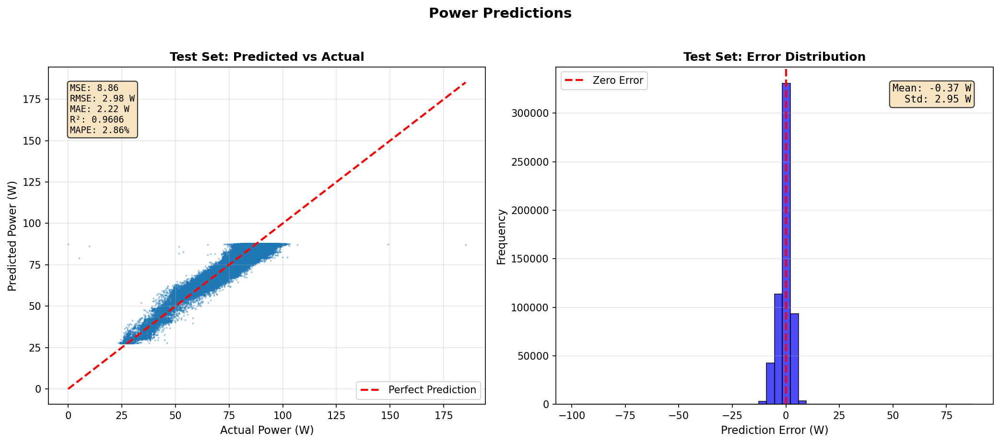
*Figure 14: v4 CNN test predictions*

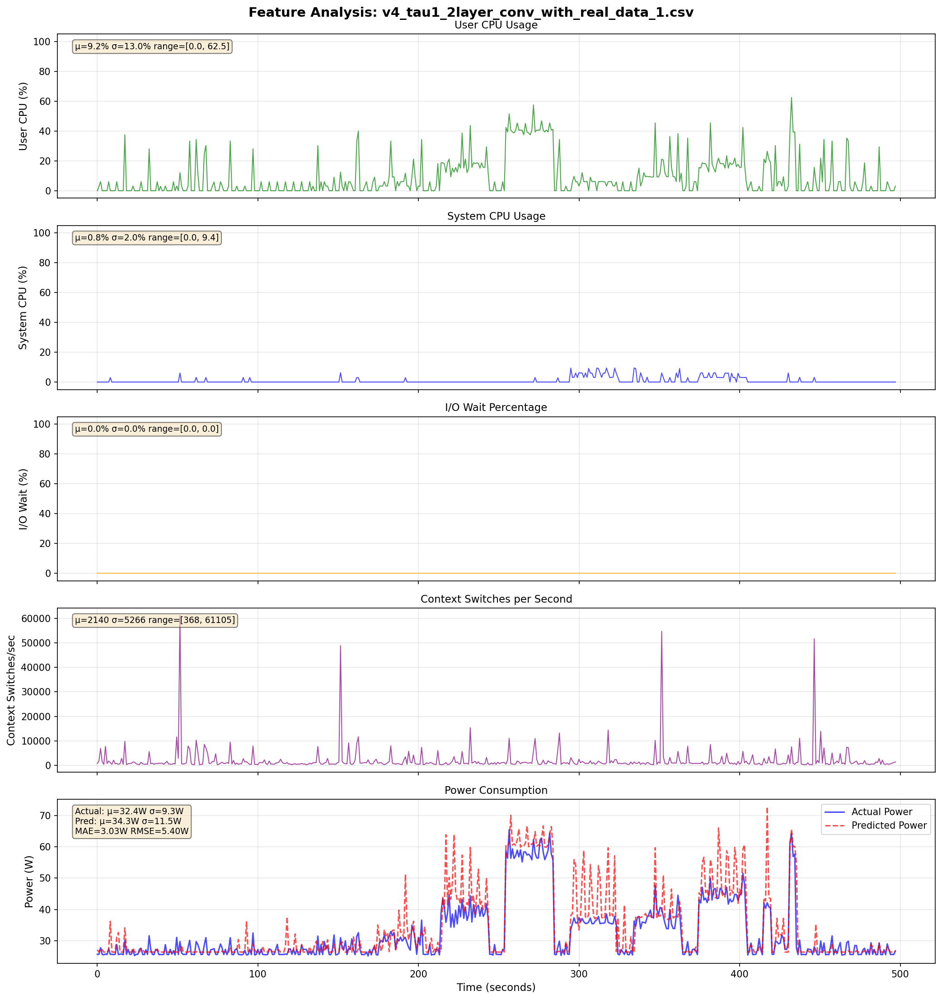
*Figure 15: v4 CNN with MAE (tau=1) improved idle baseline (~+3W error) but spike overreaction persisted.*

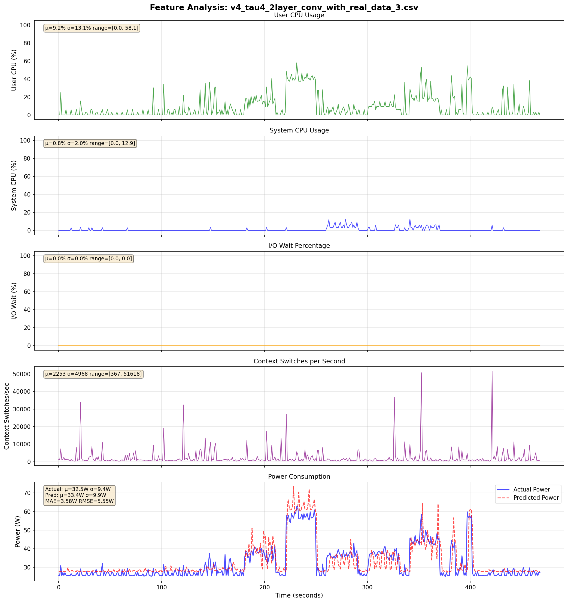
*Figure 16: v4 CNN with MAE (tau=4) still shows similar live prediction errors.*

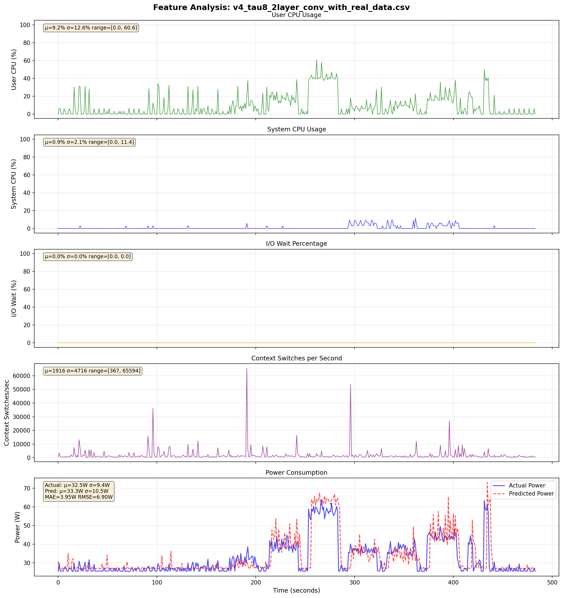
*Figure 17: v4 CNN with MAE (tau=8) still shows similar live prediction errors and slightly delayed predictions.*

---

## 6. Results and Conclusion

### Key Findings

* **Offline Success:** All models utilizing the comprehensive dataset and proper normalization (v2+Norm, v3+Norm, v4 CNN) consistently achieved high performance (**R² ≈ 0.95-0.96**, **MAE ≈ 2.1-2.4W**) on the **shuffled validation and test sets**. This proves the models learned robust average mappings for the patterns present in the combined `stress-ng` and real workload training data.

* **Live Generalization Failure:** Despite offline success, **all models failed to generalize accurately to live, sequential data** from non-`stress-ng` workloads (true idle, `/proc` reader bursts). Key failure modes persisted across architectures and hyperparameters:

    * **Idle Baseline Overprediction:** A significant positive bias (+3W to +15W depending on model/loss) when predicting power for a truly idle machine.
        * **Why this occurs:** The model likely overpredicts at idle because the `stress-ng` training data, despite including explicit "all-zero" idle runs, still lacks sufficient examples of *true idle* system behavior. The `/proc` reader test workload creates a different idle state (kernel background processes, thermal settling) than the controlled `stress-ng` idle runs. The model maps the "true idle" feature vector to the closest low-load `stress-ng` state it learned during training, which has a higher power baseline. This reveals a **data distribution gap**: our training idle samples don't fully represent real-world idle diversity.

    * **Spike Overreaction:** Exaggerated power predictions during brief, low-intensity CPU bursts, likely misinterpreting them based on patterns learned from sustained, high-power `stress-ng` loads.
        * **Why this occurs:** The spike overreaction likely occurs because the model learned from `stress-ng` that all CPU bursts—even brief ones—are high-power events. The training data predominantly contains sustained, high-intensity workloads. When the model sees a brief CPU spike from the `/proc` reader (a low-intensity I/O operation), it lacks the **feature resolution** to distinguish this from a high-intensity `stress-ng` CPU burst. The OS metrics (`user%`, `system%`) indicate CPU activity, but cannot differentiate between "reading `/proc`" (low cache pressure, simple instructions) and "running `stress-ng --cpu`" (tight compute loops, high functional unit utilization). This reveals a **feature expressiveness limitation**: our chosen OS-level observables cannot capture the microarchitectural differences that dictate power consumption.

* **Core Issue:** The models successfully follow *trends* but fail on *absolute values* and *dynamic responses* for workloads subtly different from the training majority. This suggests a fundamental limitation in the input features' ability to fully capture the relevant system state for all workload types, specifically the inability to observe microarchitectural details (instruction mix, cache behavior, sub-cycle execution patterns) that are invisible to the OS/VM guest.

### Summary

The DECODE-RAPL project successfully demonstrated that:
1.  A comprehensive, combinatorially generated dataset is essential for training power models beyond simple workload types.
2.  Sophisticated data collection (low-overhead, high-frequency Go collector) and processing (normalization, global shuffle split, delay embedding) techniques are critical for robust model development.
3.  Deep learning models (MLP, CNN) trained on VM-visible OS metrics (**User%**, **System%**, **IOWait%**, **log(Context Switches)**) with **delay embedding** can achieve high accuracy (**R² > 0.95**) in predicting power for workloads *similar* to those seen during training (primarily diverse `stress-ng` patterns).

However, the persistent failure to accurately predict power for true idle states and specific low-load, bursty real-world workloads, despite extensive architectural and methodological variations (including normalization, AE regularization, CNNs, MAE loss, varying tau), strongly suggests **fundamental limitations of the chosen OS-level features**. These metrics appear insufficient to fully capture the microarchitectural differences (e.g., instruction mix, cache behavior, sub-sampling frequency changes) that dictate power consumption accurately across *all* possible workload types within a VM environment.

The initial motivation of using dynamical systems techniques (delay embedding + autoencoders) to reconstruct a state sufficient for universal power prediction from these specific OS metrics appears challenged. While the models learn meaningful representations for certain workload classes, the chosen observables lack the resolution needed for complete state reconstruction applicable to all scenarios encountered in live testing.

The "moonshot goal" of creating a universal RAPL decoder for an architecture purely from these OS metrics within a VM appears highly difficult. While the developed models provide value for estimating power for certain classes of workloads, achieving consistently low error (<3W MAE) across all states, including idle and transient bursts, likely requires features providing deeper hardware insight, which are typically unavailable in VMs.

### Future Directions (Interim Closure)

1.  **Acknowledge Feature Limitations:** Conclude that the current feature set restricts generalization for idle/bursty workloads in VMs.
2.  **Document Achieved Performance:** Report the model's high accuracy (R² > 0.95) within the scope of workloads well-represented in the training data (e.g., `stress-ng` domain).
3.  **Explore Post-Processing:** Investigate simple calibration (e.g., subtracting the observed idle offset: +3W for v4 MAE) as a pragmatic fix for specific deployment scenarios.
4.  **Investigate Alternative VM-Visible Metrics:** If feasible, explore incorporating guest CPU frequency perception, page fault rates, or I/O throughput data to potentially enrich the input features and re-evaluate.
5.  **Revisit Multi-Machine Goal (Adversarial Training):** If data from multiple machines of the same architecture becomes available, the planned adversarial training remains a valid approach to test architecture-level generalization, acknowledging the feature limitations observed here.
