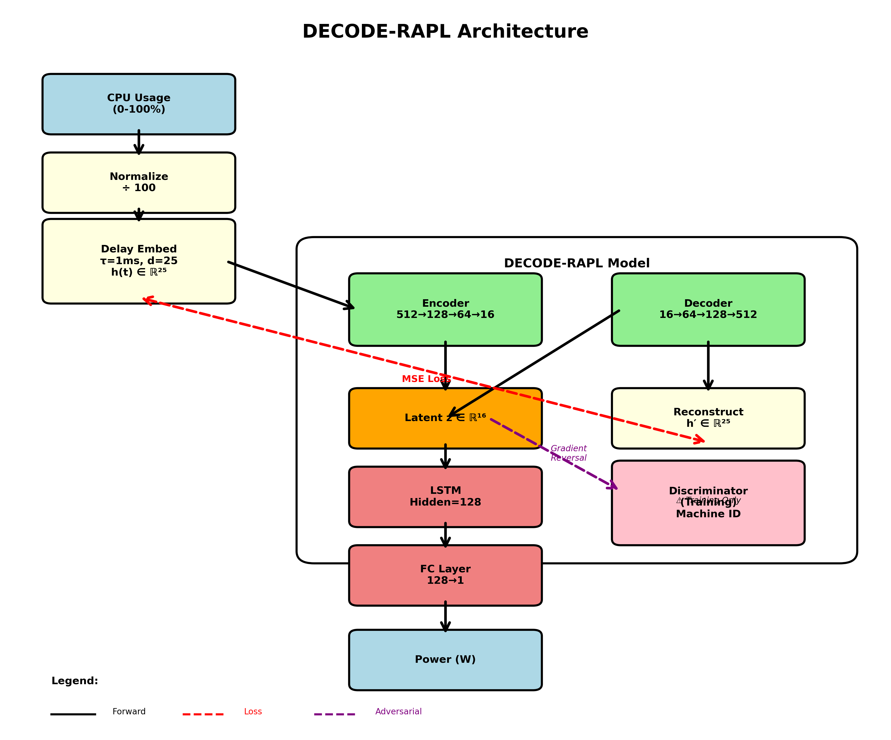
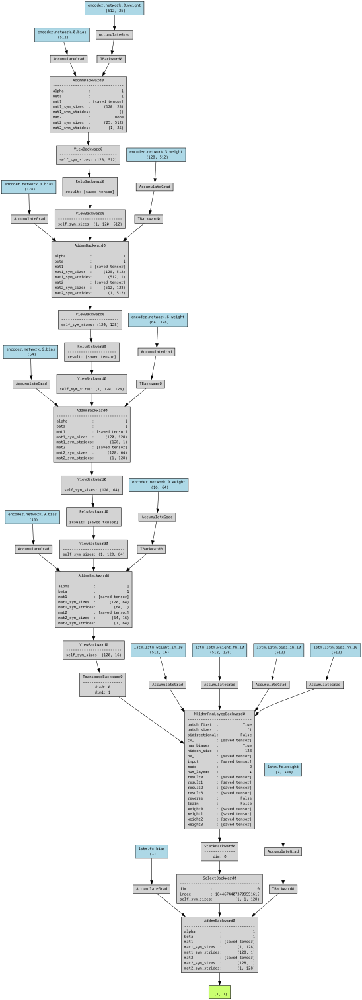
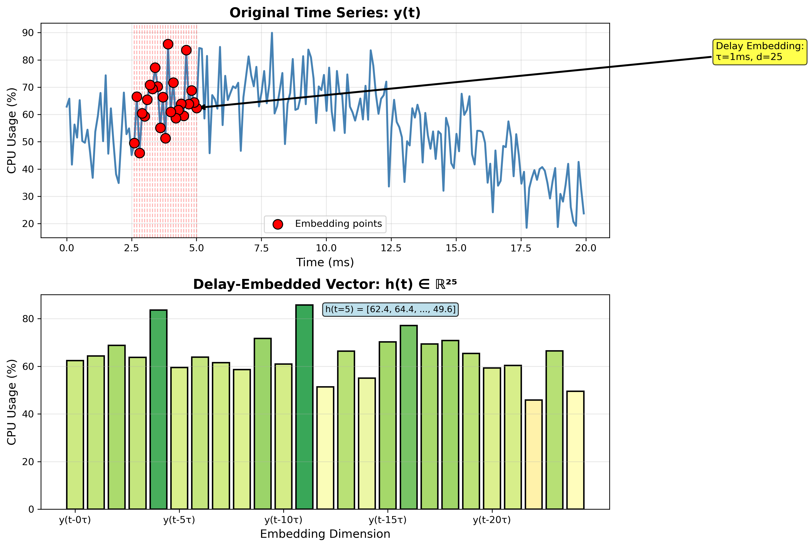
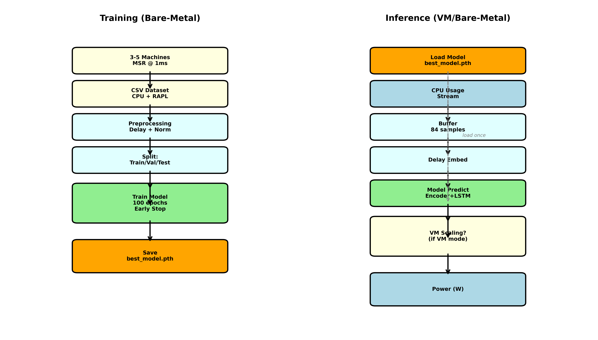

# DECODE-RAPL

**Delayed Embedding and Coherent Dynamics for Emulating RAPL**

## Overview

DECODE-RAPL is a machine learning framework for reverse-engineering Intel RAPL (Running Average Power Limit) power estimation logic. The system predicts CPU power consumption from usage metrics alone, enabling power monitoring in environments where RAPL is unavailable (e.g., virtual machines).

## Problem Statement

**Challenge**: Virtual machines cannot access RAPL MSRs (Model-Specific Registers) for power monitoring, yet power attribution is critical for:
- Multi-tenant resource accounting
- Energy-aware scheduling
- Carbon footprint tracking
- Performance/power optimization

**Solution**: Train an ML model on bare-metal machines (with RAPL access) to learn the relationship between CPU usage patterns and power consumption. Deploy the model in VMs for inference.

## Methodology

### 1. Time-Delay Embedding (Takens' Theorem)

**Motivation**: CPU-power dynamics are nonlinear and exhibit temporal dependencies. Raw CPU usage percentages don't capture these dynamics.

**Approach**: Apply time-delay embedding to reconstruct the system's attractor from partial observations:

```
h(t) = [y(t), y(t-τ), y(t-2τ), ..., y(t-(d-1)τ)]
```

Where:
- `y(t)`: CPU usage at time t
- `τ`: Time delay (1ms in our config)
- `d`: Embedding dimension (25 in our config)

This transforms a 1D time series into a high-dimensional representation that captures temporal structure.

### 2. Autoencoder for Latent Space Learning

**Challenge**: Delay embedding creates high-dimensional vectors (25D), which may be redundant.

**Approach**: Use a deep autoencoder to learn a compact latent representation (16D):

```
Encoder: R^25 → R^512 → R^128 → R^64 → R^16 (latent)
Decoder: R^16 → R^64 → R^128 → R^512 → R^25 (reconstructed)
```

The latent space captures the essential CPU usage dynamics in a compact form.

### 3. LSTM for Temporal Power Prediction

**Task**: Predict power consumption from sequences of latent representations.

**Architecture**: LSTM processes latent sequences to predict power:

```
LSTM: (batch, seq_len=120, latent_dim=16) → (batch, hidden=128) → (batch, power=1)
```

The LSTM learns temporal patterns in the latent space that correlate with power consumption.

### 4. Adversarial Training for Generalization

**Challenge**: Different machines have hardware variations (e.g., baseline power, TDP).

**Approach**: Add a discriminator that predicts machine ID from the latent space. Use gradient reversal to encourage the encoder to learn machine-invariant features.

**Loss Function**:
```
L_total = L_power_MSE + λ_recon * L_reconstruction + λ_adv * L_adversarial
```

Where:
- `L_power_MSE`: Prediction accuracy
- `L_reconstruction`: Autoencoder quality
- `L_adversarial`: Machine-invariance (fooling discriminator)

## Architecture Diagrams

### High-Level Architecture



The architecture consists of:
1. **Preprocessing**: CPU usage normalization and delay embedding
2. **Encoder**: Projects delay-embedded vectors to compact latent space (R^25 → R^16)
3. **Decoder**: Reconstructs input for autoencoder training (R^16 → R^25)
4. **LSTM**: Predicts power from latent sequences
5. **Discriminator**: (Training only) Encourages machine-invariant features via adversarial loss

### Model Computation Graph



Auto-generated from the actual PyTorch model showing all operations and data flows.

### Delay Embedding Visualization



Illustration of how time-delay embedding transforms a 1D time series into a high-dimensional representation that captures temporal dynamics.

### Training vs Inference



Comparison of training (multi-machine, batch) vs inference (single-stream, real-time) workflows.

## Data Collection

### Bare-Metal Requirements

- **Hardware**: Intel CPU with RAPL support (Sandy Bridge or later)
- **OS**: Linux with MSR kernel module (`modprobe msr`)
- **Permissions**: Root access or CAP_SYS_RAWIO capability
- **Software**: stress-ng for workload generation

### MSR Registers

- `0x30A` (IA32_FIXED_CTR1): Unhalted core cycles
- `0x30B` (IA32_FIXED_CTR2): Reference cycles
- `0x611` (MSR_PKG_ENERGY_STATUS): Package energy
- `0x606` (MSR_RAPL_POWER_UNIT): Energy unit decoder

### Data Format

CSV with columns:
```
timestamp, machine_id, cpu_usage, power
2024-01-01 00:00:00.000, machine_0, 45.2, 87.3
2024-01-01 00:00:00.001, machine_0, 46.1, 88.1
...
```

## Training

### Hyperparameters

- **Embedding**: τ=1ms, d=25
- **Encoder layers**: [512, 128, 64]
- **Latent dimension**: 16
- **LSTM hidden size**: 128
- **Sequence length**: 120 timesteps
- **Batch size**: 32
- **Learning rate**: 0.002
- **Loss weights**: power=1.0, reconstruction=0.05, adversarial=0.0 (disabled)

### Training Process

1. Load data from multiple machines (3-5 recommended)
2. Split: Train (80%) / Val (10%) / Test (10%) - cross-machine validation
3. Apply delay embedding and normalization
4. Train for up to 100 epochs with early stopping (patience=10)
5. Monitor validation MAPE (target: <5%)
6. Save best model based on validation loss

### Expected Performance

- **Test MAPE**: <5% (target accuracy with real RAPL data)
- **Training time**: ~15-20 min/epoch on consumer GPU (GTX 1650) with synthetic data
- **Model size**: ~252K parameters (current configuration)

## Inference

### Bare-Metal Inference

```python
from src.inference import RAPLPredictor

predictor = RAPLPredictor('checkpoints/best_model.pth')

# Real-time prediction
predictor.update_usage(cpu_usage)  # CPU usage %
power = predictor.predict()         # Returns power in Watts
```

### VM Inference with Scaling

VMs see only their virtualized CPU usage, not host-level usage. Apply scaling:

```
effective_host_usage = vm_usage * (vm_vcpus / host_cores)
predicted_host_power = model(effective_host_usage)
vm_power = predicted_host_power * (vm_vcpus / host_cores)
```

```python
predictor = RAPLPredictor(
    'checkpoints/best_model.pth',
    vm_mode=True,
    vm_vcpus=4,
    host_cores=16
)

predictor.update_usage(vm_cpu_usage)
vm_power = predictor.predict()
```

### Buffer Requirements

- **Buffer size**: 120 + (25-1) * 1 = 144 timesteps
- **At 1ms sampling**: 144ms of history
- **At 100ms sampling** (VM typical): 14.4 seconds of history

## Implementation Details

### Module Structure

```
src/
├── utils.py           # Synthetic data, metrics, visualization
├── preprocessing.py   # Delay embedding, dataset creation
├── model.py          # Autoencoder + LSTM + Discriminator
├── train.py          # Training pipeline
├── inference.py      # Real-time prediction
└── data_collector.py # MSR reader for bare-metal
```

### Key Classes

- `DelayEmbedding`: Implements Takens' embedding
- `RAPLDataset`: PyTorch dataset with delay embedding
- `DECODERAPLModel`: Complete model (Encoder + Decoder + LSTM + Discriminator)
- `RAPLPredictor`: Real-time inference with buffering
- `MSRReader`: Low-level MSR access for data collection

## Limitations

1. **Architecture-specific**: Model trained on Skylake won't generalize to Cascade Lake without retraining
2. **Sampling rate**: 1ms sampling requires kernel MSR access (bare-metal only)
3. **VM accuracy**: Depends on accurate vcpu/core ratio and minimal host noise
4. **Transient phenomena**: May not capture sub-millisecond power spikes
5. **RAPL accuracy**: Model learns RAPL's behavior, including its limitations (e.g., package-level only)

## Future Enhancements

1. **Multi-architecture support**: Train on diverse CPU families
2. **Additional features**: Instructions retired, cache misses, memory bandwidth
3. **Hierarchical models**: Per-core, per-socket, per-VM attribution
4. **Online learning**: Adapt to workload shifts over time
5. **Probabilistic predictions**: Uncertainty quantification via Bayesian methods

## References

1. Bakarji et al., "Discovering Governing Equations from Partial Measurements with Deep Delay Autoencoders" (2021)
2. Intel RAPL patents: US7484108B2, US9495001B2
3. Takens, F., "Detecting strange attractors in turbulence" (1981)
4. Hähnel et al., "Measuring energy consumption for short code paths using RAPL" (2012)

## Citation

If you use DECODE-RAPL in your research, please cite:

```
@software{decode_rapl_2024,
  title={DECODE-RAPL: Delayed Embedding and Coherent Dynamics for Emulating RAPL},
  author={Your Name},
  year={2024},
  url={https://github.com/yourusername/decode-rapl}
}
```
