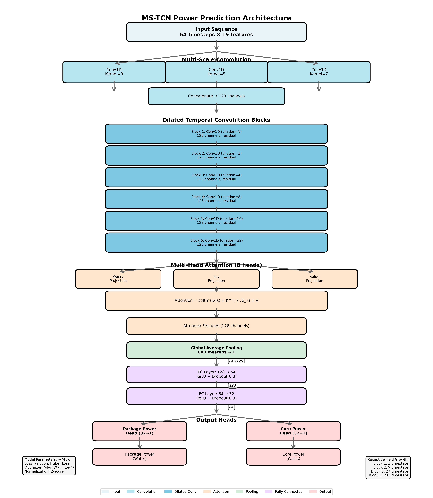

# MS-TCN Model Architecture for CPU Power Prediction

## Overview

**Model Type:** Multi-Scale Temporal Convolutional Network (MS-TCN)

**Purpose:** Predict CPU power consumption from system metrics

**Input:** 64 consecutive samples (approximately 1 second at 62.5 Hz) of 19 system features
- CPU utilization percentages (user, system, idle, iowait, irq, softirq)
- Context switches per second
- Interrupts per second
- Memory usage (used, cached, buffers, free, swap)
- Page faults per second
- System load averages (1min, 5min, 15min)
- Process counts (running, blocked)

**Output:** 2 power predictions
- Package power (entire CPU package including cores + uncore)
- Core power (CPU cores only)

**Model Size:** 740,302 trainable parameters

---

## Architecture Pipeline

### High-Level Flow

```
Input Shape: (batch_size, 64, 19)
    ↓
Multi-Scale Convolution → (batch_size, 128, 64)
    ↓
Dilated Temporal Blocks (×6) → (batch_size, 128, 64)
    ↓
Multi-Head Attention → (batch_size, 128, 64)
    ↓
Global Average Pooling → (batch_size, 128)
    ↓
Fully Connected Layer 1 → (batch_size, 256)
    ↓
Fully Connected Layer 2 → (batch_size, 128)
    ↓
Output Heads (×2) → (batch_size, 2)
```

### Architecture Diagram



*Complete architecture showing data flow from input through all components to dual power outputs.*

### Data Flow Example

**Input Sequence (t=1 to t=64):**
```
t=1-40:  CPU 5%, Mem 4000MB  (Idle state)
t=41-43: CPU 45%, Mem 5000MB (Ramp up)
t=44-64: CPU 85%, Mem 6500MB (High load)
```

**After Multi-Scale Convolution:**
- Fast branch (k=3): Detects sharp CPU jump at t=41
- Medium branch (k=5): Captures ramp trajectory t=41-43
- Slow branch (k=7): Sees sustained high load t=44-64

**After Dilated Blocks:**
- Early blocks: Learn local patterns (CPU spike shape)
- Later blocks: Learn long-term context (idle → spike → sustained)

**After Attention:**
- Assigns high weights to t=41-43 (important transition)
- Assigns medium weights to t=44-64 (current state)
- Assigns low weights to t=1-40 (irrelevant idle)

**After Pooling:**
- Single 128-dimensional vector summarizing entire sequence

**After FC Layers:**
- High-level feature combinations ready for prediction

**Final Output:**
- Package Power: 45.2W (including memory controller load)
- Core Power: 38.7W (pure CPU cores)

---

## Understanding Channels

**Channels** are independent feature maps that represent different aspects of the data.

**Input channels (19):**
Raw system metrics - each channel is one feature (cpu_user_percent, memory_used_mb, etc.)

**Output channels (128):**
Learned feature maps - each channel detects a specific pattern across all input features. For example:
- Channel 0 might detect "CPU spike with memory increase"
- Channel 1 might detect "sustained high load pattern"
- Channel 2 might detect "idle-to-active transition"

**Shape transformation:**
```
Input:  (batch, 19 channels, 64 timesteps)
Output: (batch, 128 channels, 64 timesteps)
```

Each convolutional filter processes **all 19 input features simultaneously** to produce one output channel. With 128 filters, we get 128 output channels representing 128 different learned patterns.

---

## Component 1: Multi-Scale Convolution

### Purpose
Capture patterns at different temporal resolutions simultaneously. Power consumption patterns occur at multiple timescales:
- Fast: Sudden CPU spikes (milliseconds)
- Medium: Gradual load increases (hundreds of milliseconds)
- Slow: Sustained workload patterns (full second)

### How Conv1D Works

**1D Convolution** is a sliding window operation on time series data:

1. **Window slides across timesteps** - at each position, examines kernel_size consecutive timesteps
2. **Processes all features together** - each filter has shape (input_channels × kernel_size)
   - Kernel=3: 19 features × 3 timesteps = 57 weights per filter
   - Kernel=5: 19 features × 5 timesteps = 95 weights per filter
3. **Learns cross-feature relationships** - detects patterns like "when CPU and memory both increase together over 3 timesteps"
4. **Produces one output value** per position by computing weighted sum of all inputs in the window

**Kernel size determines temporal receptive field:**
- Kernel=3: Sees 3 consecutive timesteps, detects fast changes
- Kernel=5: Sees 5 consecutive timesteps, detects medium trends
- Kernel=7: Sees 7 consecutive timesteps, detects longer patterns

### Implementation
Three parallel 1D convolution branches with different kernel sizes:

**Branch 1 (kernel=3):**
- 42 filters, each with 57 weights (19 features × 3 timesteps)
- Detects rapid changes
- Output: 42 channels

**Branch 2 (kernel=5):**
- 42 filters, each with 95 weights (19 features × 5 timesteps)
- Detects medium-term trends
- Output: 42 channels

**Branch 3 (kernel=7):**
- 44 filters, each with 133 weights (19 features × 7 timesteps)
- Detects longer-term patterns
- Output: 44 channels

**Channel distribution:** 42 + 42 + 44 = 128 total output channels. This split divides 128 as evenly as possible across 3 branches. The target of 128 channels is chosen as a power of 2 for computational efficiency.

All branches process the same input in parallel. Outputs are **concatenated** along the channel dimension:
```
Branch 1 output: (batch, 42, 64)
Branch 2 output: (batch, 42, 64)  } → Concatenate → (batch, 128, 64)
Branch 3 output: (batch, 44, 64)
```

Concatenation preserves all information from each timescale. Later layers can selectively use fast patterns (from kernel=3) or slow patterns (from kernel=7) depending on the prediction context.

---

## Component 2: Dilated Temporal Blocks

### Purpose
Expand the receptive field to see far back in time without losing temporal resolution or adding excessive parameters.

### Comparison: Multi-Scale vs Dilated Blocks

**Multi-Scale Convolution (Component 1):**
- Different **kernel sizes**: 3, 5, 7
- Same dilation: 1 (consecutive timesteps)
- **Parallel** processing
- Each branch looks at different numbers of consecutive points

**Dilated Temporal Blocks (Component 2):**
- Same **kernel size**: 3 for all blocks
- Different **dilation rates**: 1, 2, 4, 8, 16, 32
- **Sequential** processing (stacked)
- All blocks look at 3 points, but with increasing spacing between points

### Dilation Concept

**Dilation** controls the spacing between sampled points in the convolution window.

**Kernel size** determines how many points to sample. **Dilation** determines how far apart those points are.

All dilated blocks use kernel=3 (sample 3 points), but with different dilations:

**Dilation=1 (standard convolution):**
- Samples: `[t, t+1, t+2]` (consecutive)
- Weights: 3 per filter
- Effective receptive field: 3 timesteps

**Dilation=2:**
- Samples: `[t, t+2, t+4]` (skip 1 between each)
- Weights: 3 per filter
- Effective receptive field: 5 timesteps

**Dilation=4:**
- Samples: `[t, t+4, t+8]` (skip 3 between each)
- Weights: 3 per filter
- Effective receptive field: 9 timesteps

**Dilation=8:**
- Samples: `[t, t+8, t+16]`
- Effective receptive field: 17 timesteps

**Dilation=16:**
- Samples: `[t, t+16, t+32]`
- Effective receptive field: 33 timesteps

**Dilation=32:**
- Samples: `[t, t+32, t+64]`
- Effective receptive field: 65 timesteps (covers entire input sequence)

### Why Dilation is Efficient

To see 65 timesteps using standard convolution would require kernel=65:
- Weights per filter: 65 timesteps × 19 features = **1,235 weights**

Using dilated convolution with kernel=3, dilation=32:
- Weights per filter: 3 timesteps × 19 features = **57 weights**

**21× fewer parameters** while achieving the same receptive field span. This allows the model to capture long-range dependencies without excessive memory or computation.

### Architecture
Six sequential dilated temporal blocks, each containing:
1. **First convolution layer**
   - Kernel size: 3
   - Padding: (kernel_size - 1) × dilation // 2
   - Batch normalization
   - ReLU activation
   - Dropout (0.2)

2. **Second convolution layer**
   - Kernel size: 3
   - Same dilation as first layer
   - Batch normalization

3. **Residual connection**
   - If input and output channels differ: 1×1 convolution to match dimensions
   - Add input to output: `output = output + residual`
   - ReLU activation

### Why Residual Connections
Residual connections allow gradients to flow directly backward during training, preventing vanishing gradient problems in deep networks. They also allow the model to learn identity mappings (do nothing) if additional layers aren't needed.

### Receptive Field Growth
By stacking blocks with increasing dilation, the model progressively builds understanding:
- Block 1 (dilation=1): Local patterns (±1 timestep)
- Block 2 (dilation=2): Near-term context (±2 timesteps)
- Block 3 (dilation=4): Medium-term context (±4 timesteps)
- Block 4 (dilation=8): Long-term context (±8 timesteps)
- Block 5 (dilation=16): Very long-term context (±16 timesteps)
- Block 6 (dilation=32): Full sequence context (±32 timesteps)

After all 6 blocks, each position has an effective receptive field covering the entire 64-timestep input.

---

## Component 3: Multi-Head Attention

### Purpose
Learn which timesteps are most relevant for predicting power at the current moment. Not all past observations contribute equally to the prediction.

### The Attention Mechanism

**Core Idea:** For each timestep, compute a weighted combination of all timesteps in the sequence, where weights represent importance.

**Mathematical Formulation:**

Given input sequence X with shape (batch, channels=128, timesteps=64):

1. **Transpose for attention:**
   ```
   X → (batch, timesteps=64, channels=128)
   ```

2. **Compute Query (Q), Key (K), Value (V):**
   - Query: "What am I looking for?"
   - Key: "What do I contain?"
   - Value: "What information do I carry?"

   All three are linear projections of the same input:
   ```
   Q = X × W_Q  (learns to ask questions)
   K = X × W_K  (learns to answer "do I match?")
   V = X × W_V  (learns to provide information)
   ```

3. **Compute attention scores:**
   ```
   Scores = (Q × K^T) / sqrt(d_k)
   ```
   Where d_k is the dimension per head (128/8 = 16).

   This produces a (64 × 64) matrix where entry (i,j) represents how much timestep i should attend to timestep j.

4. **Apply softmax:**
   ```
   Attention_Weights = softmax(Scores, dim=-1)
   ```
   Converts scores to probabilities (sum to 1 across each row).

5. **Compute weighted values:**
   ```
   Attention_Output = Attention_Weights × V
   ```
   Each timestep now contains a weighted combination of information from all timesteps.

6. **Residual connection and normalization:**
   ```
   Output = LayerNorm(X + Dropout(Attention_Output))
   ```

### Multi-Head Attention (8 Heads)

Instead of computing attention once, the model splits the 128 channels into 8 groups of 16 channels and computes attention independently for each group.

**Why multiple heads?**

Multiple heads enable ensemble learning of diverse temporal patterns. Each head learns its focus independently during training through backpropagation - they are **not pre-programmed** to attend to specific features or timesteps.

**What each head learns is data-driven, not pre-assigned.** The 8 heads discover different attention strategies that collectively improve prediction accuracy. Examples of patterns heads *might* learn:
- Local attention: Focus on recent 5-10 timesteps (short-term trends)
- Global attention: Attend broadly across entire sequence (long-term context)
- Transition detection: High weights at idle→active or active→idle boundaries
- Smoothing: Uniform attention to average out noise
- Spike detection: Sharp peaks at sudden CPU/memory changes

**These are possibilities based on attention mechanism theory, not facts about your specific trained model.**

**To discover what your model's heads actually learned**, you would need to:
1. Extract attention weight matrices during inference (8 heads × 64×64 matrices)
2. Visualize attention patterns as heatmaps
3. Correlate high-attention timesteps with input feature behavior
4. Analyze whether heads specialize or are redundant
5. Interpret learned attention strategies from weight distributions

Each head learns its own Q, K, V transformations and produces its own attention-weighted output. All 8 head outputs are concatenated back into 128 channels.

### Concrete Example

**Scenario:** Predicting power at timestep t=64

**Input sequence (simplified, showing CPU%):**
```
t=1-40:  Idle (CPU 5%)
t=41:    Spike starts (CPU 15%)
t=42:    CPU 25%
t=43:    CPU 40%
t=44-64: Sustained high (CPU 85%)
```

**Without attention:** Model treats all 64 timesteps equally, averaging their influence.

**With attention:** Model learns that for predicting current power:
- t=1-40 (idle) get low attention weights (0.01 each) → contribute little
- t=41-43 (ramp) get medium weights (0.1 each) → show the trend
- t=44-64 (current state) get high weights (0.05 each) → current behavior matters most

**Attention weights (example):**
```
Attention(t=64 looking at t=1) = 0.01   (idle history, not relevant)
Attention(t=64 looking at t=41) = 0.10  (spike start, shows transition)
Attention(t=64 looking at t=60) = 0.08  (recent high load, very relevant)
Attention(t=64 looking at t=64) = 0.12  (current state, most relevant)
```

Sum of all weights = 1.0

The output at t=64 is:
```
output[64] = 0.01×value[1] + 0.10×value[41] + ... + 0.12×value[64]
```

This weighted combination emphasizes recent and transitional states while de-emphasizing irrelevant history.

### Why This Helps Power Prediction

Power consumption has temporal dependencies:
- **Inertia:** Power doesn't instantly jump from 10W to 50W; there's thermal and electrical lag
- **Context matters:** A CPU spike after idle consumes different power than a spike during sustained high load (thermal state differs)
- **Transients:** The rate of change (∂CPU/∂t) affects power draw

Attention allows the model to learn these temporal relationships without manually engineering features like "CPU change rate" or "time since last idle."

---

## Component 4: Global Average Pooling

### Purpose
Reduce the temporal dimension from 64 timesteps to a single vector.

### Operation
For each of the 128 channels, compute the average across all 64 timesteps:
```
output[c] = mean(input[c, :])  for each channel c
```

**Result:** Shape changes from (batch, 128, 64) to (batch, 128)

This creates a fixed-size representation summarizing the entire 1-second window.

---

## Component 5: Fully Connected Layers

### Purpose
Mix information across channels and prepare for final prediction.

**Layer 1:**
- Input: 128 features
- Linear transformation: 128 → 256
- Batch normalization (stabilizes training)
- ReLU activation (non-linearity)
- Dropout 0.2 (prevents overfitting)

**Layer 2:**
- Input: 256 features
- Linear transformation: 256 → 128
- Batch normalization
- ReLU activation

These layers learn high-level combinations of temporal features extracted by earlier layers.

---

## Component 6: Output Heads

### Purpose
Generate separate predictions for package and core power.

**Architecture:**
Two independent linear layers, each mapping 128 → 1:
- Head 1: Package power prediction
- Head 2: Core power prediction

**Why separate heads?**
Package and core power have different characteristics:
- Package = cores + uncore (memory controller, cache, interconnect)
- Core = just CPU cores

Separate heads allow specialized prediction strategies:
- Package head learns that memory-intensive workloads increase package power disproportionately
- Core head learns that pure CPU workloads affect it most

**Final output:** Concatenate both predictions → (batch, 2)

---

## Training Process

### Loss Function: Multi-Domain Huber Loss

**Huber Loss** is used instead of MSE because it's less sensitive to outliers:
```
HuberLoss(y_pred, y_true) = {
    0.5 × (y_pred - y_true)²           if |y_pred - y_true| ≤ δ
    δ × (|y_pred - y_true| - 0.5δ)     otherwise
}
```
Where δ=1.0 (configurable).

**Multi-Domain:** Separate loss for each power domain, weighted:
```
Total_Loss = 0.5 × Huber(package_pred, package_actual)
           + 0.5 × Huber(core_pred, core_actual)
```

### Optimizer: AdamW

- Learning rate: 1e-4 (0.0001)
- Weight decay: 1e-5 (L2 regularization to prevent overfitting)
- Adaptive learning rates per parameter (Adam's advantage)

### Learning Rate Schedule: Cosine Annealing

Learning rate decreases from 1e-4 to 1e-6 following a cosine curve over 200 epochs:
```
lr(epoch) = lr_min + 0.5 × (lr_max - lr_min) × (1 + cos(π × epoch / max_epochs))
```

This allows aggressive learning early and fine-tuning later.

### Early Stopping

Training stops if validation loss doesn't improve for 30 consecutive epochs (patience=30), preventing unnecessary computation and overfitting.

---

## Data Preprocessing

### Feature Normalization (Z-score)
All 19 input features are normalized to zero mean and unit variance:
```
x_normalized = (x - mean) / std
```

This ensures all features have similar scales (CPU% around 0-100, memory MB in thousands, etc. become comparable).

### Target Normalization
Power targets are also z-score normalized using the same method. During prediction, outputs are denormalized back to watts:
```
power_watts = (prediction × std) + mean
```

### Sequence Creation
Raw samples are converted into overlapping sequences with stride=1:
- Sequence 0: samples [0:64]
- Sequence 1: samples [1:65]
- Sequence 2: samples [2:66]
- ...

Each sequence predicts the power at its final timestep.

---

## Model Capacity and Memory

**Total Parameters:** 740,302

**Approximate breakdown:**
- Multi-scale convolution: ~50K parameters
- Dilated temporal blocks (6×): ~500K parameters
- Multi-head attention: ~130K parameters
- Fully connected layers: ~60K parameters

**Memory during inference:**
- Model weights: ~3 MB (float32)
- Single sequence forward pass: ~5 MB activations
- Batch of 32 sequences: ~150 MB total

**Memory during training:**
- Model + optimizer states: ~12 MB
- Batch gradients: ~150 MB
- Total: ~200-300 MB per batch

---

## Why MS-TCN for Power Prediction?

**Temporal Convolutional Networks (TCNs)** offer several advantages over alternatives:

**vs. LSTM/GRU:**
- TCNs are parallelizable (LSTMs process sequentially)
- Faster training and inference
- More stable gradients (no vanishing gradient through time)
- Explicit control over receptive field via dilation

**vs. Transformer:**
- More parameter-efficient for fixed-length sequences
- Better suited for local patterns (convolutions)
- Lower computational cost (attention is O(n²), convolutions are O(n))

**vs. Simple feedforward:**
- Captures temporal dynamics (order matters)
- Learns lag relationships (past affects present)

**Multi-Scale aspect:**
- Different power patterns have different characteristic timescales
- Single kernel size would miss either fast or slow dynamics
- Parallel branches capture full spectrum

**Attention addition:**
- Pure convolution treats all history equally
- Attention focuses on relevant moments
- Handles variable-importance timesteps (idle vs transition vs peak)

---

## Limitations and Considerations

### Feature Set Limitations
The model only sees 19 basic system metrics from /proc. It cannot distinguish workloads with identical aggregate metrics but different micro-architecture behaviors (e.g., AVX-512 vs scalar instructions at same CPU%).

### Training Data Dependency
The model learns only patterns present in training data. Workloads not represented during training will have poor predictions.

### Normalization Artifacts
Z-score normalization assumes training and inference data have similar distributions. If deployment workloads have very different power ranges, predictions may be inaccurate.

### Temporal Window Fixed
The 64-timestep (1-second) window is fixed. Very slow power changes (minutes) or very fast transients (milliseconds) may not be captured well.

### No Physical Constraints
The model doesn't enforce physical laws (e.g., power ≥ 0, package ≥ core). It's a pure statistical model. Post-processing can add such constraints.

---

## Understanding Model Behavior in Practice

### Why Overshoot Happens

When CPU load increases sharply, predictions often overshoot initially before settling:

**Observed Pattern:**
```
CPU: idle → spike (5% → 85%)
Actual Power: 25W → 35W → 45W → 50W (gradual rise)
Model Prediction: 25W → 55W → 52W → 50W (overshoots, then corrects)
```

**Root Causes:**

1. **Learned Association Without Physics:**
   - Model learned: "Sharp CPU increase → large power increase"
   - Didn't learn: "Power rises gradually due to thermal/electrical lag"
   - Training data shows correlation (CPU↑ → Power↑) but not settling dynamics

2. **Multi-Scale Convolution Response:**
   - Fast branch (k=3) detects sharp CPU spike strongly
   - Medium/slow branches (k=5, k=7) see gradual ramp
   - Initial output weighted heavily toward "spike detected!"

3. **Attention Focus:**
   - Attention mechanism assigns high weight to transition timesteps
   - Emphasizes the change itself rather than post-transition behavior
   - Learns "transitions are important" but not "transitions have inertia"

4. **Missing Physical Constraints:**
   - Model has no concept of thermal mass, capacitance, or settling time
   - Purely statistical: maps patterns to outputs
   - Doesn't know power can't change instantaneously

**Why This Matters:**
- Real-time power capping: Overshoot could trigger unnecessary throttling
- Energy estimation: Over-predicting spikes inflates total energy estimates
- Root issue: Model learns correlations, not causation

### Layer-by-Layer Contribution Analysis

Understanding what each architectural component contributes helps debug issues:

**Multi-Scale Convolution (Component 1):**
- **What it detects:** Transitions, spikes, ramps at different speeds
- **Contribution:** Identifies *that* something changed
- **Limitation:** Doesn't model *how* power responds to change

**Dilated Temporal Blocks (Component 2):**
- **What it detects:** Long-range context, workload patterns
- **Contribution:** Distinguishes "spike from idle" vs "spike during load"
- **Limitation:** Receptive field still limited to 1 second; misses minutes-long thermal effects

**Multi-Head Attention (Component 3):**
- **What it detects:** Which past moments are relevant
- **Contribution:** Weights recent activity higher than distant past
- **Limitation:** No explicit modeling of lag or inertia; attention weights are learned, not derived from physics

**Pooling + FC Layers (Components 4-5):**
- **What they detect:** High-level feature combinations
- **Contribution:** Integrates multi-scale + temporal + attention features
- **Limitation:** Black box transformation; hard to interpret what combinations matter

**Output Heads (Component 6):**
- **What they predict:** Final package/core power values
- **Contribution:** Specialized prediction per domain
- **Limitation:** Pure regression; no constraints (e.g., package ≥ core, power ≥ 0)

### Training Data Diversity Problem

**Case Study:** Model trained on stress-ng workloads fails on VM/browser workloads

**What stress-ng produces:**
- Predictable CPU patterns: 100% → 50% → 25% in regular cycles
- High interrupts_sec (>50K), high context_switches_sec (>100K)
- Sustained high load with known micro-architecture behavior
- Memory access patterns: sequential or random (controlled)

**What VM/browser produces:**
- Irregular CPU patterns: burst → idle → burst (unpredictable timing)
- Different interrupt patterns (~1-10K/sec), different context switches
- Mixed micro-architecture: JIT compilation, garbage collection, syscalls
- Memory patterns: sparse, random, cache-unfriendly

**Why Model Fails:**
- Learned "stress-ng interrupt pattern + CPU% → power"
- Never saw "VM interrupt pattern + same CPU% → different power"
- Generalization failure: correlations specific to training workload

**Key Insight:**
Model memorized **stress-ng → power mapping**, not **system activity → power physics**.

### Can We Fine-Tune on Prediction Data?

**Question:** Use model predictions as training data to improve itself?

**Why This Seems Appealing:**
- Collect predictions on new workloads (VM, browser, etc.)
- Retrain model on: old training data + new (features, predictions) pairs
- Model learns from its own outputs

**Why This Fails (Self-Supervised Learning Risk):**

1. **Error Amplification:**
   - Model predicts 40W for idle (should be 25W)
   - Fine-tuning learns: "idle features → 40W"
   - Error becomes baked into model weights
   - Next version predicts even worse

2. **No Ground Truth Correction:**
   - Without actual RAPL measurements, no error signal
   - Model reinforces its own biases
   - Systematic errors (like overshoot) get worse

3. **Distribution Shift:**
   - Fine-tuning on biased predictions shifts distribution
   - Original good predictions degraded to match new bad ones
   - Model "forgets" what it knew

**Better Alternatives:**

**Active Learning:**
- Run model on diverse workloads
- Identify samples where model is **most uncertain** (high prediction variance across timesteps)
- Collect ground truth RAPL for those specific scenarios
- Retrain with targeted data, not blind predictions

**Workload Diversification:**
- Collect real-world data: browsers, compilers, databases, VMs
- Ensure training data spans all deployment scenarios
- Model learns general "activity → power" not "stress-ng → power"

**Physics-Informed Learning:**
- Constrain model predictions using known physics
- E.g., power can't decrease faster than thermal time constant allows
- Learn residuals (what physics doesn't explain) rather than raw predictions

---

## Performance Targets

**Training Metrics:**
- Validation R² > 0.90 (explains 90%+ of variance)
- Validation MAE < 1.5W (mean absolute error under 1.5 watts)
- No overfitting (training and validation loss converge)

**Inference Metrics:**
- Prediction error < 10% for workloads similar to training
- Inference time < 5ms per prediction (real-time capable)
- Model size < 5MB (deployable to resource-constrained environments)

---

## References and Further Reading

**MS-TCN Original Paper:**
- "MS-TCN: Multi-Stage Temporal Convolutional Network for Action Segmentation" (CVPR 2019)
- Adapted here for time-series regression instead of segmentation

**Temporal Convolutional Networks:**
- "An Empirical Evaluation of Generic Convolutional and Recurrent Networks for Sequence Modeling" (arXiv:1803.01271)

**Attention Mechanisms:**
- "Attention Is All You Need" (NIPS 2017) - Original Transformer paper
- Multi-head attention formulation used here

**Power Modeling:**
- This implementation draws inspiration from software power modeling research but uses modern deep learning instead of traditional regression models.
